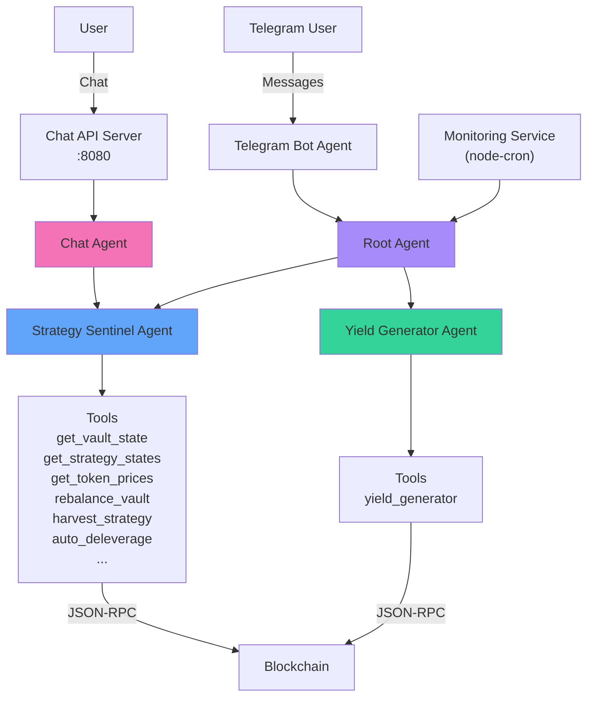
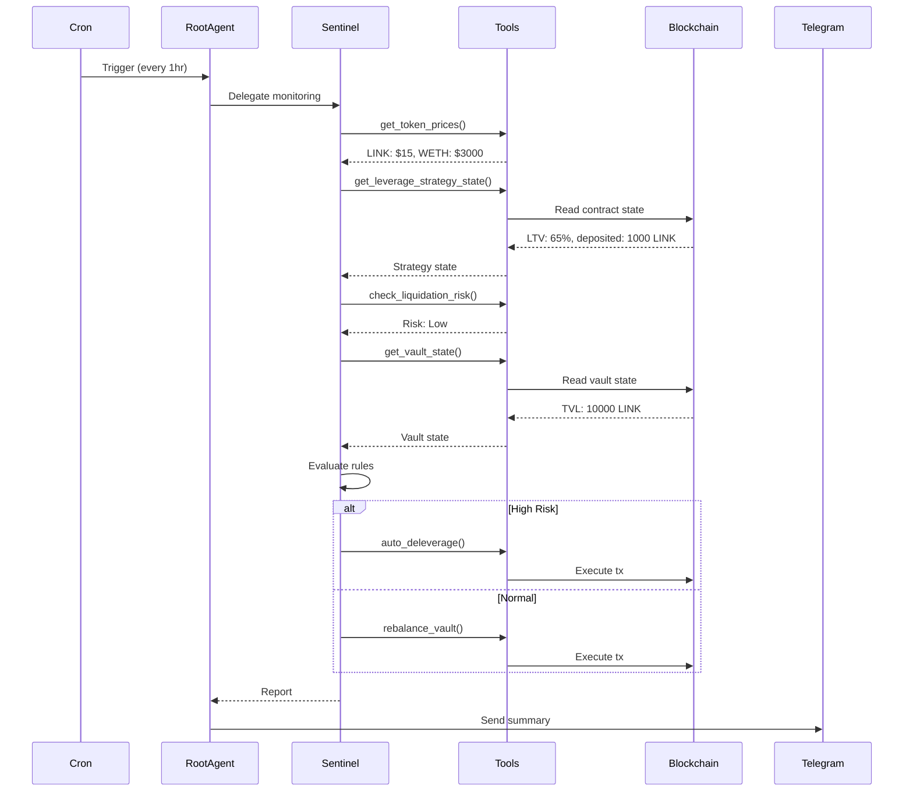
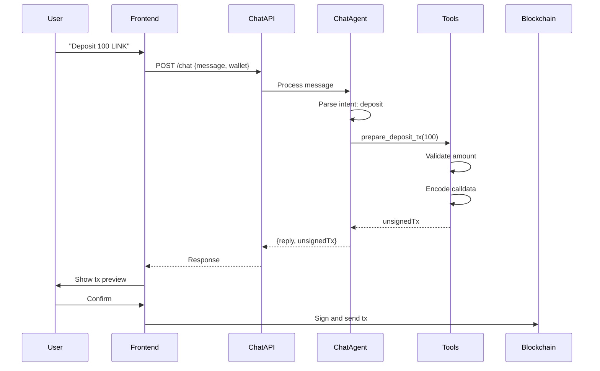

## Overview

The MetaVault AI agent system is built using **ADK-TS (Agent Development Kit)** by IQAI. It implements a hierarchical multi-agent architecture where specialized agents collaborate to monitor, manage, and optimize the DeFi vault.

## Technology Stack

| Technology | Version | Purpose |
|------------|---------|----------|
| **ADK-TS** | 0.5.7 | Agent framework and orchestration |
| **OpenRouter** | 1.2.8 | LLM provider integration |
| **Express** | 5.2.1 | HTTP server for chat API |
| **node-cron** | 4.2.1 | Scheduled monitoring tasks |
| **ethers.js** | (via ADK) | Blockchain interaction |
| **Zod** | 4.1.12 | Schema validation |
| **Dedent** | 1.7.0 | Template string formatting |

## Agent Hierarchy



## Project Structure

```
packages/agents/defi-portfolio/
├── src/
│   ├── agents/
│   │   ├── agent.ts                    # Root agent
│   │   ├── sub-agents/
│   │   │   ├── strategy-sentinel-agent/
│   │   │   │   ├── agent.ts           # Strategy sentinel
│   │   │   │   ├── tools.ts           # Vault management tools
│   │   │   │   └── apy-helper.ts      # APY calculations
│   │   │   ├── yield-generator-agent/
│   │   │   │   ├── agent.ts           # Yield generator
│   │   │   │   └── tools.ts           # Yield tools
│   │   │   └── chat-agent/
│   │   │       ├── agent.ts           # Chat agent
│   │   │       └── tools.ts           # User interaction tools
│   │   ├── telegram-agent/
│   │   │   ├── agent.ts                # Telegram bot agent
│   │   │   └── tools.ts                # Telegram tools
│   │   └── shared/
│   │       ├── abi/
│   │       │   └── index.ts           # Contract ABIs
│   │       └── utils/
│   │           ├── bigint.ts          # BigInt helpers
│   │           └── chain.ts           # Blockchain utils
│   ├── crons/
│   │   └── automation.ts               # Monitoring service
│   ├── server.ts                       # Express chat server
│   ├── index.ts                        # Main entry point
│   └── env.ts                          # Environment config
├── package.json
└── tsconfig.json
```

## ADK-TS Integration

### Why ADK-TS?

ADK-TS provides:

1. **Conversation Orchestration**: Handles session memory and context
2. **Tool Management**: Structured tool definitions and response formatting
3. **TypeScript Native**: Full type safety for tools and agents
4. **Sub-Agent Coordination**: Hierarchical agent delegation
5. **State Management**: Built-in state caching and persistence
6. **MCP Integration**: Model Context Protocol for tool calling

### Agent Builder Pattern

```typescript
import { AgentBuilder } from "@iqai/adk";

export const getRootAgent = async () => {
  const strategySentinelAgent = await getStrategySentinelAgent();
  const yieldSimulatorAgent = await getYieldGeneratorAgent();
  
  return AgentBuilder
    .create("root_agent")
    .withDescription("AI Agent that monitors and manages the Vault")
    .withInstruction(`
      Use the sub-agent Strategy Sentinel Agent for vault operations.
      Use the sub-agent Yield Generator Agent for yield accrual.
    `)
    .withModel(model)
    .withSubAgents([strategySentinelAgent, yieldSimulatorAgent])
    .build();
};
```

## Agent Definitions

### 1. Root Agent

**File**: `src/agents/agent.ts`

**Purpose**: Top-level orchestrator that delegates to specialized sub-agents.

**Capabilities**:
- Routes requests to appropriate sub-agents
- Coordinates multi-step operations
- Manages agent lifecycle

**Sub-Agents**:
- Strategy Sentinel Agent
- Yield Generator Agent

### 2. Strategy Sentinel Agent

**File**: `src/agents/sub-agents/strategy-sentinel-agent/agent.ts`

**Purpose**: The primary vault management agent responsible for monitoring, risk management, and strategy optimization.

**Key Responsibilities**:

1. **Monitoring**:
   - Track vault state (TVL, shares, NAV)
   - Monitor strategy allocations and balances
   - Fetch real-time token prices (LINK/WETH)
   - Check user balances and growth

2. **Risk Management**:
   - Calculate LTV (Loan-to-Value) ratios
   - Detect liquidation risks
   - Auto-deleverage when thresholds exceeded
   - Pause strategies during high volatility

3. **Portfolio Management**:
   - Rebalance between strategies based on targets
   - Adjust target weights based on market conditions
   - Update leverage parameters (maxDepth, borrowFactor)
   - Harvest yields and compound profits

4. **Decision Making**:
   - Price-based: Adjust strategy based on LINK/WETH volatility
   - LTV-based: Deleverage when LTV > 70%
   - Target-based: Rebalance when allocations diverge >5%

**Instruction Snippet**:

```typescript
instruction: dedent`
  You are the Strategy Sentinel Agent, responsible for monitoring, 
  analyzing, and managing every strategy within the portfolio.
  
  **PRICE-BASED DECISION MAKING:**
  - ALWAYS check LINK and WETH prices using get_token_prices
  - Monitor price movements and volatility
  - When LINK/WETH price ratio changes >10%, consider:
    * Volatile/dropping → pause leverage or reduce params
    * Stable/favorable → maintain or increase leverage
  
  **LEVERAGE STRATEGY STATE MANAGEMENT:**
  - Check leverage state using get_leverage_strategy_state
  - Monitor LTV, borrowed amounts, pause status
  - When LTV > 70% or prices volatile → pause or reduce
  
  **TARGET WEIGHT MANAGEMENT:**
  - Default targets: leverage 80%, AAVE 20%
  - Adjust using update_strategy_target_weights
  - After updating, call rebalance_vault
  
  Never perform unsafe actions. Base all decisions on tool outputs.
`
```

**Tools** (18 total):
- `get_strategy_states` - Read strategy balances
- `get_user_balances` - Read user shares/assets
- `get_vault_state` - Read vault statistics
- `get_token_prices` - Fetch LINK/WETH prices from CoinGecko
- `get_leverage_strategy_state` - Read leverage details
- `get_vault_apy` - Calculate vault APY
- `check_liquidation_risk` - Assess liquidation danger
- `rebalance_vault` - Trigger rebalancing
- `harvest_strategy` - Collect strategy profits
- `vault_deposit` - Deposit funds
- `vault_withdraw` - Withdraw funds
- `auto_deleverage` - Emergency deleveraging
- `update_strategy_target_weights` - Change allocations
- `toggle_leverage_strategy_pause` - Pause/unpause leverage
- `update_leverage_params` - Adjust maxDepth/borrowFactor

### 3. Yield Generator Agent

**File**: `src/agents/sub-agents/yield-generator-agent/agent.ts`

**Purpose**: Simulates yield accrual for testing and demonstration.

**Capabilities**:
- Accrue interest to mock Aave pool
- Generate yield events
- Validate profit distribution

**Tools**:
- `yield_generator` - Accrue interest to the pool

### 4. Chat Agent

**File**: `src/agents/sub-agents/chat-agent/agent.ts`

**Purpose**: Provides natural language interface for users to interact with their vault.

**Capabilities**:
- Answer questions about vault statistics
- Check user balances and growth
- Generate unsigned transactions for deposits/withdrawals
- Enforce security boundaries (user-specific data only)

**Security**:
- NEVER exposes admin functions to users
- NEVER accesses other users' data
- ALWAYS validates wallet address from request
- Only provides unsigned transactions (user signs in frontend)

**Tools**:
- `get_user_balance` - Read user shares
- `get_user_growth` - Calculate user PnL
- `prepare_deposit_tx` - Create unsigned deposit tx
- `prepare_withdraw_tx` - Create unsigned withdraw tx

### 5. Telegram Bot Agent

**File**: `src/agents/telegram-agent/agent.ts`

**Purpose**: Sends monitoring reports to Telegram channel.

**Capabilities**:
- Format reports for Telegram (no markdown)
- Send messages to configured channel
- Handle monitoring summaries

**Sub-Agents**:
- Strategy Sentinel Agent (for data fetching)

**Tools** (via ADK-TS MCP):
- `telegram_send_message` - Send message to channel

## Tool System

### Tool Definition Pattern

ADK-TS uses a structured tool definition format:

```typescript
import { tool } from "@iqai/adk";
import { z } from "zod";

export const get_vault_state = tool({
  name: "get_vault_state",
  description: "Fetches the current vault state including TVL, shares, and NAV",
  parameters: z.object({}), // No parameters needed
  execute: async () => {
    // Read from blockchain
    const contract = new Contract(VAULT_ADDRESS, VAULT_ABI, provider);
    
    const [totalAssets, totalShares, nav] = await Promise.all([
      contract.totalManagedAssets(),
      contract.totalSupply(),
      contract.getNAV()
    ]);
    
    return {
      success: true,
      data: {
        totalAssets: formatEther(totalAssets),
        totalShares: formatEther(totalShares),
        nav: formatEther(nav),
        sharePrice: totalShares > 0n 
          ? formatEther(nav * 1e18n / totalShares) 
          : "1.0"
      }
    };
  }
});
```

### Key Tools

#### get_token_prices
```typescript
export const get_token_prices = tool({
  name: "get_token_prices",
  description: "Fetches real-time LINK and WETH prices from CoinGecko API",
  parameters: z.object({}),
  execute: async () => {
    const response = await fetch(
      "https://api.coingecko.com/api/v3/simple/price?ids=chainlink,ethereum&vs_currencies=usd"
    );
    const data = await response.json();
    
    const linkPrice = data.chainlink.usd;
    const wethPrice = data.ethereum.usd;
    const ratio = linkPrice / wethPrice;
    
    return {
      success: true,
      data: {
        link: linkPrice,
        weth: wethPrice,
        ratio: ratio,
        timestamp: new Date().toISOString()
      }
    };
  }
});
```

#### rebalance_vault
```typescript
export const rebalance_vault = tool({
  name: "rebalance_vault",
  description: "Triggers rebalancing to match target allocations",
  parameters: z.object({}),
  execute: async () => {
    const contract = new Contract(ROUTER_ADDRESS, ROUTER_ABI, signer);
    
    const tx = await contract.rebalance();
    await tx.wait();
    
    return {
      success: true,
      message: "Vault rebalanced successfully",
      txHash: tx.hash
    };
  }
});
```

#### update_strategy_target_weights
```typescript
export const update_strategy_target_weights = tool({
  name: "update_strategy_target_weights",
  description: "Updates target allocation weights (must sum to 10000 bps)",
  parameters: z.object({
    leverageWeight: z.number().min(0).max(10000),
    aaveWeight: z.number().min(0).max(10000)
  }),
  execute: async ({ leverageWeight, aaveWeight }) => {
    if (leverageWeight + aaveWeight !== 10000) {
      return { success: false, error: "Weights must sum to 10000" };
    }
    
    const contract = new Contract(ROUTER_ADDRESS, ROUTER_ABI, signer);
    
    const strategies = [
      STRATEGY_LEVERAGE_ADDRESS,
      STRATEGY_AAVE_ADDRESS
    ];
    const weights = [leverageWeight, aaveWeight];
    
    const tx = await contract.setStrategies(strategies, weights);
    await tx.wait();
    
    return {
      success: true,
      message: "Target weights updated",
      txHash: tx.hash
    };
  }
});
```

## Monitoring Service

**File**: `src/crons/automation.ts`

**Purpose**: Automated health checks and maintenance tasks.

### Cron Schedule

- **Monitoring Cycle**: Every 1 hour (`0 */1 * * *`)
- **Yield Generation**: Every 2 minutes (`*/2 * * * *`)

### Monitoring Cycle Steps

```typescript
public async runMonitoringCycle(): Promise<void> {
  const runner = getRootAgent().runner;
  
  // 1. Check market prices
  const priceCheck = await runner.ask(
    "Check real LINK and WETH prices and evaluate volatility (>10%)."
  );
  
  // 2. Check leverage strategy state
  const leverageCheck = await runner.ask(
    "Use get_leverage_strategy_state to evaluate LTV and pause status."
  );
  
  // 3. Assess liquidation risk
  const riskCheck = await runner.ask(
    "Check liquidation risk and identify if deleveraging is required."
  );
  
  // 4. Check vault and strategy states
  const vaultCheck = await runner.ask(
    "Fetch vault and strategy states. Target weights: 80% leverage, 20% Aave."
  );
  
  // 5. Decision making
  const actions = await runner.ask(
    dedent`
      Based on price, strategy, and risk data:
      - Pause/resume leverage if needed
      - Update leverage parameters if volatile
      - Rebalance if allocations diverge
      - Harvest yields
      Provide reasoning and simulate before recommending.
    `
  );
  
  // 6. Send report to Telegram
  await this.sendTelegramSummary(/* summary */);
}
```

## Chat Server

**File**: `src/server.ts`

**Purpose**: Express server that exposes the Chat Agent via REST API.

### Endpoints

#### POST /chat

**Request**:
```json
{
  "message": "What's my balance?",
  "wallet": "0x1234...",
  "sessionId": "1234567890"
}
```

**Response**:
```json
{
  "success": true,
  "sessionId": "1234567890",
  "reply": "You have 100 shares worth 105 LINK.",
  "unsignedTx": null,
  "step": ""
}
```

**Response with Transaction**:
```json
{
  "success": true,
  "reply": "I've prepared a deposit transaction for you.",
  "unsignedTx": {
    "to": "0xVault...",
    "data": "0x...",
    "value": "0"
  },
  "step": "deposit"
}
```

#### GET /session/:id

Returns full conversation history for a session.

#### POST /session/reset/:id

Resets a session's conversation history.

#### GET /health

Health check endpoint.

### Session Management

```typescript
interface ChatSession {
  history: ChatMessage[];
  createdAt: string;
  updatedAt: string;
}

const sessions = new Map<string, ChatSession>();

function getSession(sessionId: string): ChatSession {
  if (!sessions.has(sessionId)) {
    sessions.set(sessionId, {
      history: [],
      createdAt: new Date().toISOString(),
      updatedAt: new Date().toISOString()
    });
  }
  return sessions.get(sessionId)!;
}
```

## Data Flow

### Automated Monitoring Flow



### User Chat Flow



## Security

### Agent Security

1. **Private Key Management**:
   - Stored in environment variables
   - Never logged or exposed
   - Separate keys for different environments

2. **Tool Access Control**:
   - Chat Agent: Read-only tools + unsigned tx preparation
   - Strategy Sentinel: Full vault management
   - Yield Generator: Limited to yield accrual

3. **Input Validation**:
   - All tool parameters validated with Zod schemas
   - Amount checks before transactions
   - Address validation

4. **Rate Limiting**:
   - Cron jobs on fixed schedule (no excessive polling)
   - API rate limits on external services

### Chat Agent Boundaries

```typescript
// NEVER expose admin functions
const FORBIDDEN_ACTIONS = [
  "rebalance",
  "harvest",
  "setStrategies",
  "triggerDeleverage"
];

// ALWAYS validate wallet address
if (!wallet || wallet === "0x0") {
  return { error: "Invalid wallet address" };
}

// ONLY access requesting user's data
const userBalance = await contract.balanceOf(wallet); // ✅
const allUsers = await contract.getAllUsers(); // ❌ FORBIDDEN
```

## Environment Configuration

**File**: `src/env.ts`

```typescript
export const env = {
  // LLM
  OPENROUTER_API_KEY: process.env.OPENROUTER_API_KEY!,
  MODEL: process.env.MODEL || "openai/gpt-4-turbo",
  
  // Blockchain
  RPC_URL: process.env.RPC_URL || "http://localhost:8545",
  CHAIN_ID: parseInt(process.env.CHAIN_ID || "31337"),
  PRIVATE_KEY: process.env.PRIVATE_KEY!,
  
  // Contracts
  VAULT_ADDRESS: process.env.VAULT_ADDRESS!,
  ROUTER_ADDRESS: process.env.ROUTER_ADDRESS!,
  STRATEGY_AAVE_ADDRESS: process.env.STRATEGY_AAVE_ADDRESS!,
  STRATEGY_LEVERAGE_ADDRESS: process.env.STRATEGY_LEVERAGE_ADDRESS!,
  
  // Telegram
  TELEGRAM_BOT_TOKEN: process.env.TELEGRAM_BOT_TOKEN!,
  TELEGRAM_CHANNEL_ID: process.env.TELEGRAM_CHANNEL_ID!,
  
  // Server
  PORT: process.env.PORT || 3000,
  CHAT_PORT: process.env.CHAT_PORT || 8080
};
```

## Deployment

### Railway (Recommended)

```json
// railway.json
{
  "build": {
    "builder": "NIXPACKS"
  },
  "deploy": {
    "startCommand": "pnpm start",
    "restartPolicyType": "ON_FAILURE",
    "restartPolicyMaxRetries": 10
  }
}
```

### Docker

```dockerfile
FROM node:18-alpine
WORKDIR /app
COPY package*.json ./
RUN npm install
COPY . .
RUN npm run build
EXPOSE 8080
CMD ["node", "dist/index.js"]
```

## Monitoring & Logging

### Console Logging
```typescript
console.log("🤖 Starting MonitoringService...");
console.log("✅ Monitoring cycle finished");
console.error("❌ Error:", err.message);
```

### Telegram Reports
- Hourly monitoring summaries
- Error notifications
- Action confirmations

## Performance Considerations

- **Cron Frequency**: Hourly checks to avoid excessive gas costs
- **Tool Caching**: ADK-TS handles state caching
- **Batch Queries**: Use `Promise.all()` for parallel reads
- **Error Recovery**: Try/catch on all blockchain calls

## Future Enhancements

- **Vector DB Integration**: Store historical data for ML analysis
- **Multi-Chain Support**: Deploy agents across chains
- **Advanced Risk Models**: Machine learning for risk prediction
- **Governance Agent**: DAO proposal creation and voting
- **Analytics Agent**: Generate insights and reports

## Related Documentation

- [System Overview](/architecture/system-overview)
- [Smart Contracts Architecture](/architecture/smart-contracts)
- [Frontend Architecture](/architecture/frontend)