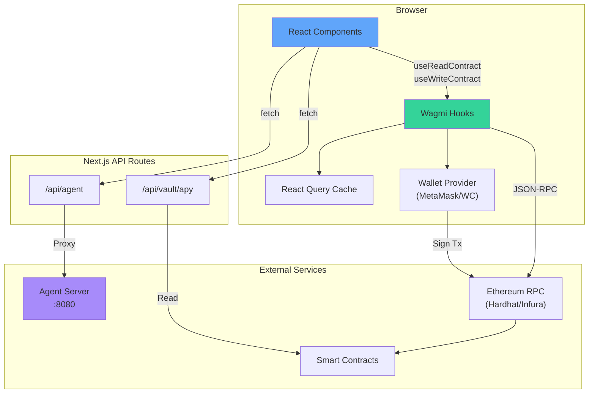
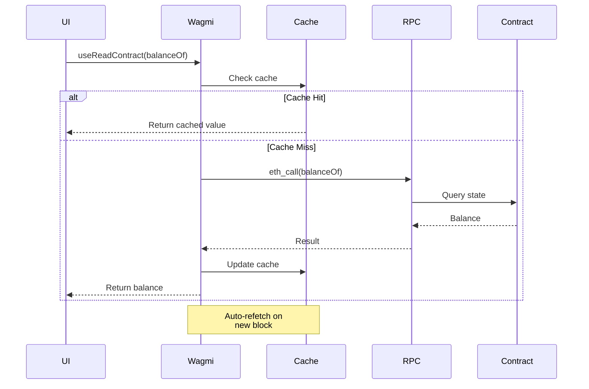
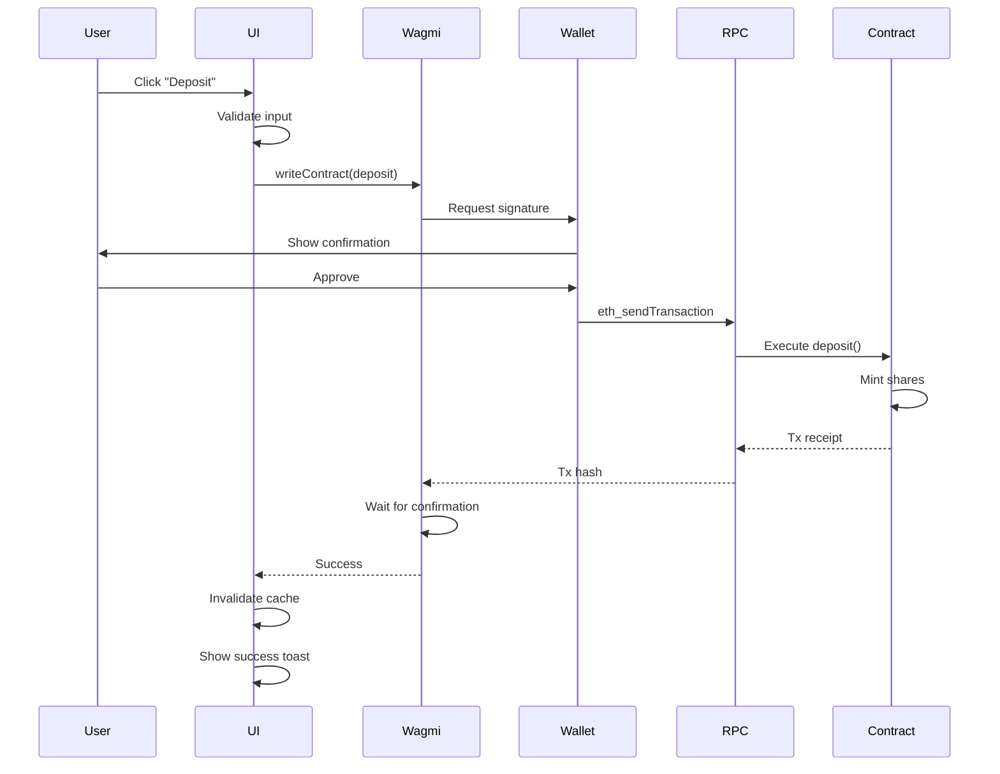
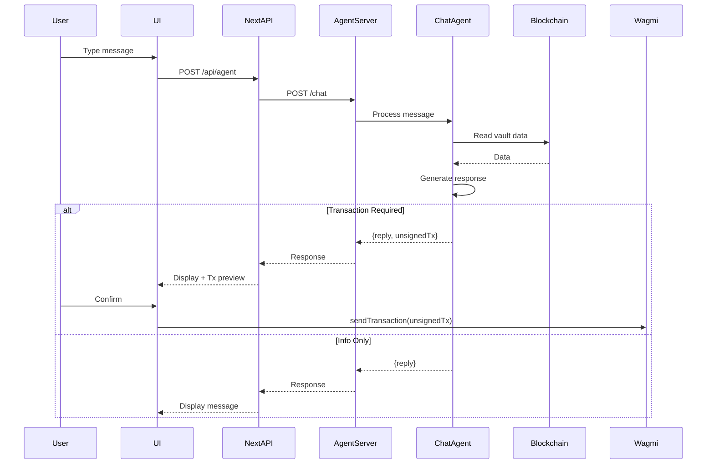

## Overview

The MetaVault frontend is built with **Next.js 14** using the App Router, TypeScript, and Tailwind CSS. It provides a modern, responsive interface for users to interact with the vault, monitor their positions, and chat with AI agents.

## Technology Stack

| Technology | Version | Purpose |
|------------|---------|----------|
| **Next.js** | 14.2.0 | React framework with App Router |
| **React** | 18.3.0 | UI library |
| **TypeScript** | 5.5.0 | Type safety |
| **Tailwind CSS** | 3.4.0 | Styling |
| **Wagmi** | 2.7.0 | React hooks for Ethereum |
| **Viem** | 2.9.0 | TypeScript Ethereum library |
| **TanStack Query** | 5.51.0 | Data fetching and caching |
| **WalletConnect** | 2.21.10 | Wallet connection |
| **Lucide React** | 0.400.0 | Icons |

## Project Structure

```
packages/frontend/
├── src/
│   ├── app/
│   │   ├── api/
│   │   │   ├── agent/
│   │   │   │   └── route.ts          # Proxy to agent server
│   │   │   └── vault/
│   │   │       └── apy/
│   │   │           └── route.ts      # APY calculation endpoint
│   │   ├── layout.tsx                # Root layout with providers
│   │   ├── page.tsx                  # Main page with tabs
│   │   ├── providers.tsx             # Web3 providers setup
│   │   └── globals.css               # Global styles
│   ├── components/
│   │   ├── VaultDashboard.tsx        # Main dashboard view
│   │   ├── AgentChat.tsx             # AI chat interface
│   │   ├── WalletConnect.tsx         # Wallet connection button
│   │   ├── DepositModal.tsx          # Deposit modal
│   │   ├── WithdrawModal.tsx         # Withdraw modal
│   │   ├── StrategyCard.tsx          # Strategy allocation card
│   │   ├── ActivityCard.tsx          # Recent activity feed
│   │   └── DepositorsList.tsx        # Top depositors list
│   ├── config/
│   │   └── wagmi.ts                  # Wagmi configuration
│   └── lib/
│       ├── contracts.ts              # Contract addresses and ABIs
│       └── utils.ts                  # Utility functions
├── public/
├── package.json
└── next.config.js
```

## Architecture Diagram



## Key Components

### 1. App Router Structure

**File**: `src/app/page.tsx`

The main page implements a tabbed interface:

```tsx
export default function Home() {
  const [activeTab, setActiveTab] = useState<"vault" | "agent">("vault");

  return (
    <div className="flex min-h-screen">
      {/* Sidebar with navigation */}
      <div className="w-64">
        <nav>
          <button onClick={() => setActiveTab("vault")}>Dashboard</button>
          <button onClick={() => setActiveTab("agent")}>AI Assistant</button>
        </nav>
      </div>
      
      {/* Main content */}
      <div className="flex-1">
        <WalletConnect />
        {activeTab === "vault" && <VaultDashboard />}
        {activeTab === "agent" && <AgentChat />}
      </div>
    </div>
  );
}
```

### 2. Web3 Provider Setup

**File**: `src/app/providers.tsx`

```tsx
import { WagmiProvider } from "wagmi";
import { QueryClient, QueryClientProvider } from "@tanstack/react-query";
import { config } from "@/config/wagmi";

const queryClient = new QueryClient();

export function Providers({ children }: { children: React.ReactNode }) {
  return (
    <WagmiProvider config={config}>
      <QueryClientProvider client={queryClient}>
        {children}
      </QueryClientProvider>
    </WagmiProvider>
  );
}
```

**File**: `src/config/wagmi.ts`

```tsx
import { createConfig, http } from "wagmi";
import { hardhat } from "wagmi/chains";
import { walletConnect, injected } from "wagmi/connectors";

export const config = createConfig({
  chains: [hardhat],
  connectors: [
    injected(), // MetaMask
    walletConnect({ projectId: process.env.NEXT_PUBLIC_WC_PROJECT_ID! })
  ],
  transports: {
    [hardhat.id]: http("http://localhost:8545")
  }
});
```

### 3. VaultDashboard Component

**File**: `src/components/VaultDashboard.tsx`

The main dashboard shows:
- Vault statistics (TVL, APY, user shares)
- Strategy allocations
- Deposit/withdraw actions
- Recent activity
- Top depositors

**Data Fetching**:

```tsx
import { useReadContract, useAccount } from "wagmi";
import { CONTRACTS, VAULT_ABI, ROUTER_ABI } from "@/lib/contracts";

export function VaultDashboard() {
  const { address } = useAccount();
  
  // Fetch vault statistics
  const { data: totalAssets } = useReadContract({
    address: CONTRACTS.VAULT,
    abi: VAULT_ABI,
    functionName: "totalManagedAssets"
  });
  
  const { data: userShares } = useReadContract({
    address: CONTRACTS.VAULT,
    abi: VAULT_ABI,
    functionName: "balanceOf",
    args: [address!],
    query: { enabled: !!address }
  });
  
  const { data: userValue } = useReadContract({
    address: CONTRACTS.VAULT,
    abi: VAULT_ABI,
    functionName: "convertToAssets",
    args: [userShares || 0n]
  });
  
  // Fetch strategy allocations
  const { data: portfolioState } = useReadContract({
    address: CONTRACTS.ROUTER,
    abi: ROUTER_ABI,
    functionName: "getPortfolioState"
  });
  
  // Fetch APY from API route
  const { data: apyData } = useQuery({
    queryKey: ["apy"],
    queryFn: () => fetch("/api/vault/apy").then(res => res.json())
  });
  
  return (
    <div>
      {/* Stats cards */}
      <div className="grid grid-cols-3 gap-4">
        <StatCard title="TVL" value={formatEther(totalAssets)} />
        <StatCard title="APY" value={`${apyData?.apy}%`} />
        <StatCard title="Your Shares" value={formatEther(userShares)} />
      </div>
      
      {/* Strategy allocations */}
      <div className="grid grid-cols-2 gap-4">
        {portfolioState?.strats.map((strat, i) => (
          <StrategyCard
            key={strat}
            address={strat}
            balance={portfolioState.balances[i]}
            target={portfolioState.targets[i]}
          />
        ))}
      </div>
      
      {/* Actions */}
      <div>
        <DepositModal />
        <WithdrawModal />
      </div>
    </div>
  );
}
```

### 4. Deposit/Withdraw Flows

**File**: `src/components/DepositModal.tsx`

```tsx
import { useWriteContract, useWaitForTransactionReceipt } from "wagmi";
import { parseEther } from "viem";

export function DepositModal() {
  const [amount, setAmount] = useState("");
  const { writeContract, data: hash } = useWriteContract();
  const { isLoading: isConfirming } = useWaitForTransactionReceipt({ hash });
  
  const handleDeposit = async () => {
    // Step 1: Approve LINK
    await writeContract({
      address: CONTRACTS.LINK,
      abi: ERC20_ABI,
      functionName: "approve",
      args: [CONTRACTS.VAULT, parseEther(amount)]
    });
    
    // Step 2: Deposit
    await writeContract({
      address: CONTRACTS.VAULT,
      abi: VAULT_ABI,
      functionName: "deposit",
      args: [parseEther(amount)]
    });
  };
  
  return (
    <Modal>
      <input
        type="number"
        value={amount}
        onChange={(e) => setAmount(e.target.value)}
        placeholder="Amount to deposit"
      />
      <button onClick={handleDeposit} disabled={isConfirming}>
        {isConfirming ? "Confirming..." : "Deposit"}
      </button>
    </Modal>
  );
}
```

### 5. AgentChat Component

**File**: `src/components/AgentChat.tsx`

Provides a chat interface to interact with AI agents:

```tsx
export function AgentChat() {
  const { address } = useAccount();
  const [messages, setMessages] = useState<Message[]>([]);
  const [input, setInput] = useState("");
  const [sessionId] = useState(() => Date.now().toString());
  
  const sendMessage = async () => {
    const userMessage = { role: "user", content: input };
    setMessages(prev => [...prev, userMessage]);
    setInput("");
    
    // Call agent API
    const response = await fetch("/api/agent", {
      method: "POST",
      headers: { "Content-Type": "application/json" },
      body: JSON.stringify({
        message: input,
        wallet: address,
        sessionId
      })
    });
    
    const data = await response.json();
    
    // Handle unsigned transaction if present
    if (data.unsignedTx) {
      // Show transaction preview and confirmation button
      setMessages(prev => [...prev, {
        role: "assistant",
        content: data.reply,
        tx: data.unsignedTx
      }]);
    } else {
      setMessages(prev => [...prev, {
        role: "assistant",
        content: data.reply
      }]);
    }
  };
  
  return (
    <div className="flex flex-col h-full">
      {/* Messages */}
      <div className="flex-1 overflow-y-auto">
        {messages.map((msg, i) => (
          <div key={i} className={msg.role === "user" ? "text-right" : "text-left"}>
            <p>{msg.content}</p>
            {msg.tx && (
              <button onClick={() => signAndSendTx(msg.tx)}>Confirm Transaction</button>
            )}
          </div>
        ))}
      </div>
      
      {/* Input */}
      <div className="border-t p-4">
        <input
          value={input}
          onChange={(e) => setInput(e.target.value)}
          onKeyPress={(e) => e.key === "Enter" && sendMessage()}
          placeholder="Ask me anything about your vault..."
        />
        <button onClick={sendMessage}>Send</button>
      </div>
    </div>
  );
}
```

### 6. API Routes

#### Agent Proxy

**File**: `src/app/api/agent/route.ts`

```tsx
import { NextRequest, NextResponse } from "next/server";

export async function POST(req: NextRequest) {
  const body = await req.json();
  
  // Proxy to agent server
  const response = await fetch(`${process.env.AGENT_SERVER_URL}/chat`, {
    method: "POST",
    headers: { "Content-Type": "application/json" },
    body: JSON.stringify(body)
  });
  
  const data = await response.json();
  return NextResponse.json(data);
}
```

#### APY Calculation

**File**: `src/app/api/vault/apy/route.ts`

```tsx
import { NextResponse } from "next/server";
import { createPublicClient, http } from "viem";
import { hardhat } from "viem/chains";
import { CONTRACTS, ROUTER_ABI } from "@/lib/contracts";

export async function GET() {
  const client = createPublicClient({
    chain: hardhat,
    transport: http("http://localhost:8545")
  });
  
  // Read strategy stats
  const strategies = await client.readContract({
    address: CONTRACTS.ROUTER,
    abi: ROUTER_ABI,
    functionName: "getStrategies"
  });
  
  // Calculate weighted APY
  let totalApy = 0;
  // ... calculation logic ...
  
  return NextResponse.json({ apy: totalApy });
}
```

## State Management

### Local State
- **React useState**: UI state (modals, inputs, tabs)
- **React useReducer**: Complex forms

### Server State
- **TanStack Query**: Blockchain data caching
- **Wagmi Hooks**: Automatic re-fetching on block changes

### Web3 State
- **Wagmi**: Account, chain, connection status
- **Wallet Provider**: Signer, transactions

## Data Flow

### Read Flow (Vault Balance)



### Write Flow (Deposit)



### Agent Chat Flow



## Styling

### Tailwind Configuration

Custom theme with dark mode:

```css
/* globals.css */
@tailwind base;
@tailwind components;
@tailwind utilities;

@layer base {
  body {
    @apply bg-[#05050A] text-white;
  }
}

@layer utilities {
  .glass-panel {
    @apply bg-white/5 backdrop-blur-xl border border-white/10 rounded-2xl;
  }
}
```

### Design System

- **Colors**: Dark theme with blue/violet accents
- **Typography**: Inter font family
- **Spacing**: 4px base unit (Tailwind default)
- **Components**: Glass-morphism effects
- **Icons**: Lucide React

## Performance Optimizations

### React Query Caching
```tsx
const queryClient = new QueryClient({
  defaultOptions: {
    queries: {
      staleTime: 10_000, // 10 seconds
      cacheTime: 5 * 60 * 1000, // 5 minutes
    }
  }
});
```

### Wagmi Auto-Refetch
```tsx
const { data } = useReadContract({
  // ...
  query: {
    refetchInterval: 12_000, // Every block (~12s)
  }
});
```

### Code Splitting
- Next.js automatic code splitting
- Dynamic imports for modals

### Image Optimization
- Next.js `<Image>` component
- WebP format with fallbacks

## Error Handling

### Network Errors
```tsx
const { data, error, isError } = useReadContract({
  // ...
  query: {
    retry: 3,
    retryDelay: (attempt) => Math.min(1000 * 2 ** attempt, 30000)
  }
});

if (isError) {
  return <ErrorState message={error.message} />;
}
```

### Transaction Errors
```tsx
const { writeContract, error } = useWriteContract();

try {
  await writeContract({...});
} catch (err) {
  if (err.code === 4001) {
    toast.error("Transaction rejected");
  } else if (err.code === -32603) {
    toast.error("Insufficient funds");
  } else {
    toast.error("Transaction failed");
  }
}
```

## Environment Variables

```env
# .env.local
NEXT_PUBLIC_VAULT_ADDRESS=0x...
NEXT_PUBLIC_ROUTER_ADDRESS=0x...
NEXT_PUBLIC_STRATEGY_AAVE_ADDRESS=0x...
NEXT_PUBLIC_STRATEGY_LEVERAGE_ADDRESS=0x...
NEXT_PUBLIC_LINK_ADDRESS=0x...
NEXT_PUBLIC_WC_PROJECT_ID=abc123
NEXT_PUBLIC_RPC_URL=http://localhost:8545
AGENT_SERVER_URL=http://localhost:8080
```

## Testing Strategy

- **Unit Tests**: Component logic (Jest + React Testing Library)
- **Integration Tests**: Contract interactions (Playwright)
- **E2E Tests**: Full user flows (Playwright + Hardhat)
- **Visual Tests**: Storybook for component library

## Deployment

### Vercel (Recommended)
```bash
# Install Vercel CLI
npm i -g vercel

# Deploy
cd packages/frontend
vercel
```

### Docker
```dockerfile
FROM node:18-alpine
WORKDIR /app
COPY package*.json ./
RUN npm install
COPY . .
RUN npm run build
EXPOSE 3000
CMD ["npm", "start"]
```

## Related Documentation

- [System Overview](/architecture/system-overview)
- [Smart Contracts Architecture](/architecture/smart-contracts)
- [Agent System Architecture](/architecture/agent-system)