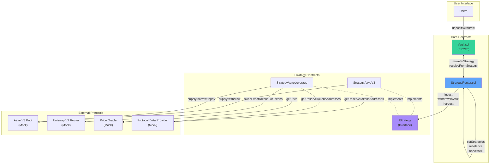
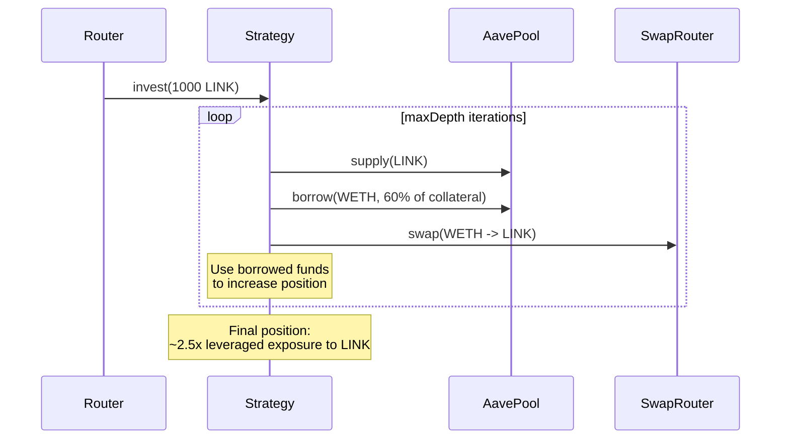
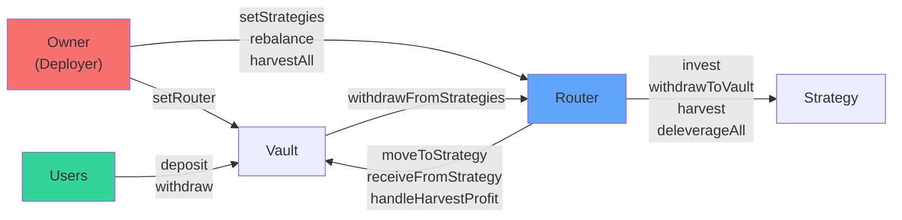

## Overview

The MetaVault smart contract system is built on **Solidity ^0.8.28** using the Hardhat development framework. It implements a modular vault architecture with pluggable strategies, enabling flexible asset allocation and risk management.

## Contract Architecture Diagram



## Core Contracts

### 1. Vault.sol

**Location**: `packages/contracts/contracts/Vault.sol`

**Purpose**: The main vault contract that manages user deposits, withdrawals, and share accounting.

#### Key Features

- **ERC20 Shares**: Users receive "Vault Share Tokens" (VST) representing their portion of the vault
- **Share-Based Accounting**: Automatically handles profit distribution through share value appreciation
- **Fee Management**: Performance fees and withdrawal fees
- **User Tracking**: Tracks deposits and withdrawals for PnL calculation

#### State Variables

```solidity
IERC20 public immutable asset;           // Underlying token (e.g., LINK)
uint256 public performanceFeeBps;        // Performance fee in basis points
address public feeRecipient;             // Address receiving fees
uint256 public withdrawFeeBps;           // Withdrawal fee in basis points
address public router;                   // Authorized StrategyRouter

mapping(address => uint256) public netDeposited;   // User deposit tracking
mapping(address => uint256) public totalWithdrawn; // User withdrawal tracking
```

#### Core Functions

**Deposit**
```solidity
function deposit(uint256 amount) external returns (uint256 shares)
```
- Converts assets to shares using `convertToShares()`
- Transfers assets from user to vault
- Mints shares to user
- Tracks deposit history

**Withdraw**
```solidity
function withdraw(uint256 shares) external returns (uint256 assetsOut)
```
- Burns user's shares
- Pulls assets from strategies if needed (via router)
- Applies withdrawal fee
- Transfers assets to user
- Tracks withdrawal history

**Share Conversion**
```solidity
function convertToShares(uint256 assets) public view returns (uint256)
function convertToAssets(uint256 shares) public view returns (uint256)
```
- Implements ERC4626-style share calculation
- Adjusts for total managed assets across all strategies

**User Growth Tracking**
```solidity
function userGrowth(address user) public view returns (int256)
function userGrowthPercent(address user) external view returns (int256)
```
- Calculates profit/loss for individual users
- Returns absolute PnL and percentage growth

**Strategy Integration**
```solidity
function moveToStrategy(address strategy, uint256 amount) external onlyRouter
function receiveFromStrategy(uint256 amount) external onlyRouter
function handleHarvestProfit(uint256 profit) external onlyRouter
```
- Router-only functions for fund movement
- `moveToStrategy`: Transfers funds to strategy for investment
- `receiveFromStrategy`: Accounting hook when funds return
- `handleHarvestProfit`: Applies performance fee to profits

**Total Managed Assets**
```solidity
function totalManagedAssets() public view returns (uint256)
```
- Sums vault balance + all strategy balances
- Used for share price calculation

### 2. StrategyRouter.sol

**Location**: `packages/contracts/contracts/strategy/StrategyRouter.sol`

**Purpose**: Orchestrates capital allocation across multiple strategies.

#### Key Features

- **Multi-Strategy Management**: Tracks and allocates to multiple strategies
- **Target-Based Allocation**: Each strategy has a target weight in basis points (0-10000)
- **Automated Rebalancing**: Pulls from overweight strategies, pushes to underweight
- **Harvest Coordination**: Collects profits from all strategies
- **Risk Management**: Can trigger deleveraging on risky strategies

#### State Variables

```solidity
IVault public immutable vault;               // Reference to vault
address[] public strategies;                 // List of active strategies
mapping(address => uint256) public targetBps; // Target allocation (basis points)
```

#### Core Functions

**Strategy Configuration**
```solidity
function setStrategies(
    address[] calldata _strats, 
    uint256[] calldata _bps
) external onlyOwner
```
- Sets active strategies and their target allocations
- Validates that targets sum to 10000 (100%)
- Clears old strategies before setting new ones

**Rebalancing**
```solidity
function rebalance() external onlyOwner
```

1. Calculate total managed assets (vault + strategies)
2. For each strategy:
   - If **overweight**: Withdraw excess to vault
   - If **underweight**: Move funds from vault to strategy
3. Recalculate after each step to handle dynamic balances
4. Uses try/catch to handle failing strategies gracefully

**Harvesting**
```solidity
function harvestAll() external onlyOwner
```
- Iterates through all strategies
- Calls `harvest()` on each
- Measures vault balance before/after
- Applies performance fee via `vault.handleHarvestProfit()`

**Manual Fund Movement**
```solidity
function moveFundsToStrategy(address strat, uint256 amount) external onlyOwner
function moveAllToStrategy(address strat) external onlyOwner
```
- Owner functions for manual capital allocation
- Used by AI agents to deploy funds

**Withdrawal Support**
```solidity
function withdrawFromStrategies(uint256 amount) external returns (uint256)
```
- Called by vault when user withdraws but vault lacks liquidity
- Iterates strategies, pulling funds until amount satisfied
- Handles failures gracefully with try/catch

**Deleveraging**
```solidity
function triggerDeleverage(address strat, uint256 maxLoops) external onlyOwner
```
- Triggers deleveraging on a specific strategy
- Used by agents during high-risk periods

**Portfolio Queries**
```solidity
function getPortfolioState() external view returns (
    address[] memory strats,
    uint256[] memory balances,
    uint256[] memory targets
)
```
- Returns current state of all strategies
- Used by frontend and agents for monitoring

## Strategy Interface

**Location**: `packages/contracts/contracts/interfaces/IStrategy.sol`

```solidity
interface IStrategy {
    function strategyBalance() external view returns (uint256);
    function invest(uint256 amount) external;
    function withdrawToVault(uint256 amount) external returns (uint256);
    function harvest() external;
    function deleverageAll(uint256 maxLoops) external;
}
```

### Strategy Implementations

#### 1. StrategyAaveV3

**Location**: `packages/contracts/contracts/strategy/StrategyAave.sol`

**Type**: Safe, passive yield strategy

**Mechanism**:
1. Supplies LINK to Aave V3 lending pool
2. Earns supply APY from borrowers
3. Tracks principal vs aToken balance to measure profit

**Key Functions**:

```solidity
function invest(uint256 amount) external override onlyRouter {
    pool.supply(address(token), amount, address(this), 0);
    deposited += amount;
}

function withdrawToVault(uint256 amount) external override onlyRouter returns(uint256) {
    uint256 out = pool.withdraw(address(token), amount, address(this));
    token.safeTransfer(vault, out);
    deposited -= out;
    return out;
}

function harvest() external override onlyRouter {
    (address aTokenAddr, , ) = dataProvider.getReserveTokensAddresses(address(token));
    uint256 aBal = IERC20(aTokenAddr).balanceOf(address(this));
    
    if (aBal > deposited) {
        uint256 profit = aBal - deposited;
        uint256 out = pool.withdraw(address(token), profit, address(this));
        token.safeTransfer(vault, out);
    }
}

function strategyBalance() public view override returns (uint256) {
    return pool.getUnderlyingValue(address(this), address(token));
}
```

**Risk Profile**: Low (no borrowing, no liquidation risk)

#### 2. StrategyAaveLeverage

**Location**: `packages/contracts/contracts/strategy/StrategyAaveLeverage.sol`

**Type**: Aggressive, leveraged yield strategy

**Mechanism** (Looping):



**Key State Variables**:

```solidity
uint256 public deposited;        // Principal deposited
uint256 public borrowedWETH;     // Total WETH borrowed
uint8 public maxDepth = 3;       // Max loop iterations
uint256 public borrowFactor = 6000; // Borrow 60% of collateral each loop
bool public paused;              // Emergency pause flag
```

**Key Functions**:

```solidity
function invest(uint256 amount) external override onlyRouter {
    require(!paused, "paused");
    
    for (uint8 i = 0; i < maxDepth; i++) {
        // Supply LINK to Aave
        pool.supply(address(token), amount, address(this), 0);
        
        // Calculate how much WETH we can borrow
        uint256 linkPrice = oracle.getPrice(address(token));
        uint256 wethPrice = oracle.getPrice(WETH);
        uint256 collateralValue = (amount * linkPrice) / 1e18;
        uint256 borrowValue = (collateralValue * borrowFactor) / 10000;
        uint256 borrowAmount = (borrowValue * 1e18) / wethPrice;
        
        // Borrow WETH
        pool.borrow(WETH, borrowAmount, 2, 0, address(this));
        borrowedWETH += borrowAmount;
        
        // Swap WETH for LINK
        address[] memory path = new address[](2);
        path[0] = WETH;
        path[1] = address(token);
        
        uint[] memory amounts = swapRouter.swapExactTokensForTokens(
            borrowAmount,
            0, // accept any amount (risky in prod!)
            path,
            address(this),
            block.timestamp + 300
        );
        
        amount = amounts[1]; // LINK received
    }
    
    deposited += initialAmount;
}

function deleverageAll(uint256 maxLoops) external override onlyRouter {
    for (uint256 i = 0; i < maxLoops; i++) {
        uint256 debt = pool.getUserDebt(address(this), WETH);
        if (debt == 0) break;
        
        // Withdraw some LINK
        uint256 withdrawAmt = /* calculate safe amount */;
        pool.withdraw(address(token), withdrawAmt, address(this));
        
        // Swap LINK -> WETH
        // Repay debt
        pool.repay(WETH, repayAmount, 2, address(this));
    }
}

function togglePause() external onlyRouter {
    paused = !paused;
}

function setLeverageParams(uint8 _maxDepth, uint256 _borrowFactor) external onlyRouter {
    require(_maxDepth <= 6, "maxDepth too large");
    require(_borrowFactor <= 8000, "borrowFactor too high");
    maxDepth = _maxDepth;
    borrowFactor = _borrowFactor;
}
```

**Risk Profile**: High
- Liquidation risk if LINK price drops
- LTV must stay below Aave's liquidation threshold
- AI agents monitor and auto-deleverage when needed

## Mock Contracts (Testing)

For development, the system uses mock contracts:

- **MockAavePoolB**: Simulates Aave supply/borrow/repay
- **MockSwapRouterV2**: Simulates Uniswap V2 swaps
- **MockPriceOracle**: Returns mock prices for LINK/WETH
- **MockProtocolDataProvider**: Returns aToken addresses
- **MockERC20**: Standard ERC20 with mint function
- **MockAToken**: Simulates interest-bearing aTokens

## Access Control



### Access Control Summary

| Function | Caller | Contract | Purpose |
|----------|--------|----------|----------|
| `deposit/withdraw` | Users | Vault | User operations |
| `setRouter` | Owner | Vault | One-time setup |
| `setStrategies` | Owner | Router | Configure allocations |
| `rebalance` | Owner | Router | Reallocate funds |
| `harvestAll` | Owner | Router | Collect profits |
| `moveFundsToStrategy` | Owner | Router | Manual allocation |
| `triggerDeleverage` | Owner | Router | Risk management |
| `moveToStrategy` | Router | Vault | Fund movement |
| `invest` | Router | Strategy | Deploy capital |
| `harvest` | Router | Strategy | Collect yield |

**Note**: The "Owner" is typically an EOA controlled by the AI agent system.

## Events

### Vault Events
```solidity
event Deposit(address indexed user, uint256 amount, uint256 shares);
event Withdraw(address indexed user, uint256 amount, uint256 shares);
```

### Router Events
```solidity
event StrategiesUpdated();
event Rebalanced(uint256 totalManaged);
event Harvested(address indexed strat, uint256 profit);
event WithdrawnFromStrategies(uint256 requested, uint256 pulled);
event DeleverageTriggered(address indexed strat, uint256 maxLoops);
event StrategyWithdrawFailed(address indexed strat, string reason);
```

### Strategy Events
```solidity
event InvestedLeveraged(uint256 initial, uint8 depth, uint256 finalSupplied, uint256 borrowedWETH);
event Deleveraged(uint256 repaidWETH, uint256 redeemedLINK);
event Harvested(uint256 profit);
event PauseToggled(bool paused);
event LeverageParamsUpdated(uint8 maxDepth, uint256 borrowFactor);
```

## Gas Optimization

- **Immutable Variables**: Contract addresses stored as `immutable`
- **Batch Operations**: `harvestAll()` instead of individual harvests
- **View Functions**: Extensive use for gas-free reads
- **SafeERC20**: Only where necessary (external calls)
- **Mapping vs Array**: Mappings for O(1) lookups

## Security Considerations

1. **Reentrancy**: Checks-effects-interactions pattern
2. **Integer Overflow**: Solidity ^0.8.0 has built-in checks
3. **Access Control**: `onlyOwner` and `onlyRouter` modifiers
4. **Failed Strategy Handling**: Try/catch blocks in router
5. **Price Manipulation**: Uses Chainlink oracles in production
6. **Slippage Protection**: Min output amounts in swaps (not in mocks)

## Deployment

**Script**: `packages/contracts/scripts/deploy_mocks.ts`

**Deployment Order**:
1. Deploy mock ERC20 tokens (LINK, WETH)
2. Deploy mock Aave pool and data provider
3. Deploy mock swap router and oracle
4. Deploy Vault
5. Deploy StrategyRouter
6. Deploy strategies (Aave, Leverage)
7. Configure router with strategies and target weights
8. Transfer ownership to agent EOA

## Testing

**Framework**: Hardhat + Chai

**Test Coverage**:
- Deposit/withdraw flows
- Share price calculation
- Rebalancing logic
- Strategy investment/withdrawal
- Leverage looping
- Deleveraging
- Fee distribution
- Access control

## Future Enhancements

- **Governance**: Transition to multi-sig or DAO
- **More Strategies**: Curve, Convex, Yearn integrations
- **Flash Loan Rebalancing**: Use Aave flash loans for efficient rebalancing
- **Circuit Breakers**: Auto-pause on extreme market conditions
- **Upgradability**: UUPS proxy pattern for upgradable strategies

## Related Documentation

- [System Overview](/architecture/system-overview)
- [Frontend Architecture](/architecture/frontend)
- [Agent System Architecture](/architecture/agent-system)