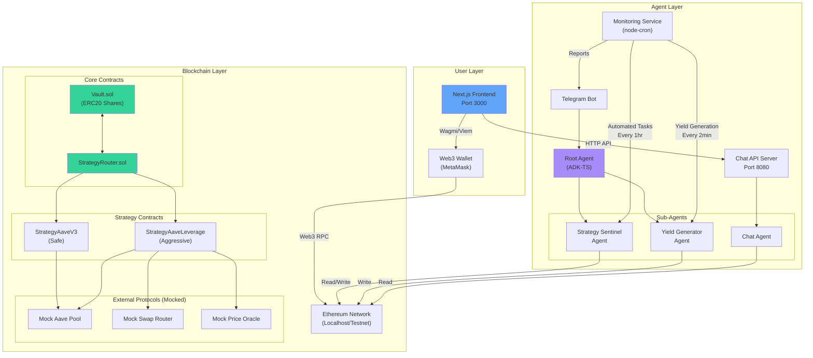
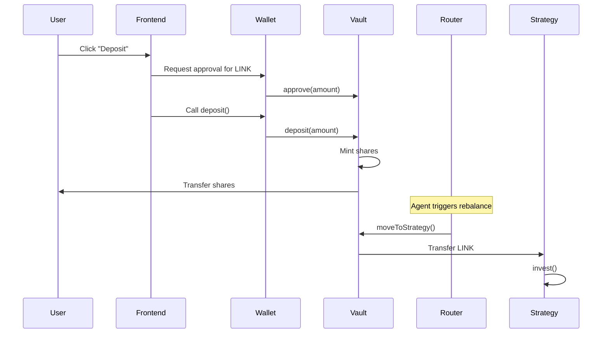
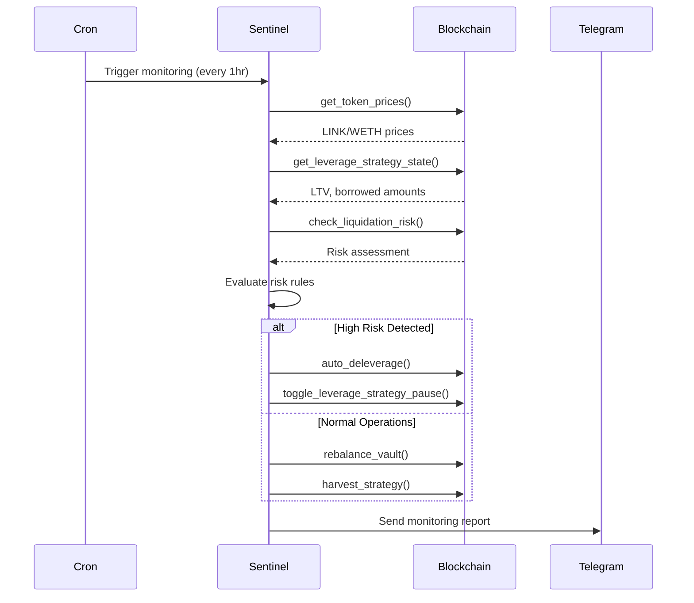

## Introduction

MetaVault AI is an autonomous DeFi vault platform that combines smart contracts, AI agents, and a modern web interface. The system is built as a **monorepo** using pnpm workspaces, enabling tight integration between all components.

## Architecture Diagram



## Monorepo Structure

The project uses **pnpm workspaces** to manage multiple packages:

```
metavault-ai/
├── packages/
│   ├── contracts/          # Smart contracts (Hardhat)
│   ├── frontend/           # Next.js web app
│   └── agents/
│       └── defi-portfolio/ # AI agents (ADK-TS)
├── package.json            # Root workspace config
├── pnpm-workspace.yaml     # Workspace definition
└── pnpm-lock.yaml          # Lockfile
```

### Package Dependencies

- **Root**: Orchestrates all packages with unified scripts
- **Contracts**: Independent, no internal dependencies
- **Frontend**: Consumes contract ABIs and addresses
- **Agents**: Interacts with deployed contracts via ethers.js

## Key Components

### 1. Smart Contracts (`packages/contracts`)

**Technology**: Solidity ^0.8.28, Hardhat, OpenZeppelin

- **Vault.sol**: ERC20 vault token with share-based accounting
- **StrategyRouter.sol**: Manages strategy allocation and rebalancing
- **Strategies**: Multiple yield-generating strategies (Aave, Leverage)
- **Mocks**: Testing infrastructure for Aave, Uniswap, oracles

### 2. Frontend (`packages/frontend`)

**Technology**: Next.js 14, TypeScript, Tailwind CSS, Wagmi, Viem

- **App Router**: Modern Next.js routing
- **API Routes**: `/api/agent` and `/api/vault/apy` endpoints
- **Wallet Integration**: WalletConnect + Wagmi for Web3 interactions
- **Components**: Dashboard, modals, agent chat interface

### 3. AI Agents (`packages/agents/defi-portfolio`)

**Technology**: ADK-TS (Agent Development Kit), Express, node-cron

- **Root Agent**: Coordinates sub-agents
- **Strategy Sentinel**: Monitors vault health, manages risk
- **Yield Generator**: Simulates/accrues yield
- **Chat Agent**: User interaction via natural language
- **Telegram Bot**: Sends monitoring reports
- **Monitoring Service**: Automated cron jobs for health checks

## Data Flow

### Deposit Flow



### Agent Monitoring Flow



## Communication Protocols

### Frontend ↔ Blockchain
- **Protocol**: JSON-RPC over HTTP/WebSocket
- **Libraries**: Wagmi (React hooks) + Viem (low-level)
- **Methods**: Read (view functions), Write (transactions)

### Frontend ↔ Chat API
- **Protocol**: REST API (HTTP/JSON)
- **Endpoint**: `POST /chat`
- **Authentication**: Wallet address in request body

### Agents ↔ Blockchain
- **Protocol**: JSON-RPC via ethers.js
- **Methods**: Read (contract queries), Write (signed transactions)
- **Signer**: Private key from environment variables

### Agents ↔ Telegram
- **Protocol**: Telegram Bot API via ADK-TS MCP
- **Library**: `@iqai/adk` with Telegram toolset
- **Direction**: One-way (agents → users)

## Security Architecture

### Smart Contract Security
- **Access Control**: Ownable pattern for admin functions
- **Role Separation**: Router is the only entity that can move funds
- **SafeERC20**: All token transfers use OpenZeppelin's SafeERC20
- **Reentrancy Protection**: Checks-effects-interactions pattern

### Agent Security
- **Private Keys**: Stored in environment variables
- **API Keys**: Telegram bot tokens and RPC URLs secured
- **Chat Agent Boundaries**: Enforces user-specific data access
- **No Direct Vault Control**: Users can't trigger admin functions via chat

### Frontend Security
- **Client-Side Validation**: All inputs validated before submission
- **Wallet Signatures**: Users sign transactions locally
- **Environment Variables**: Contract addresses from `.env.local`
- **CSP Headers**: Content Security Policy for XSS protection

## Deployment Architecture

### Local Development
```
Terminal 1: pnpm dev:contracts  # Hardhat node + deploy
Terminal 2: pnpm dev:agents     # Agent server + cron
Terminal 3: pnpm dev            # Next.js frontend
```

### Production
- **Contracts**: Deployed to Ethereum mainnet/L2
- **Frontend**: Vercel/Netlify (static + serverless)
- **Agents**: Railway/Render (Node.js server)
- **Database**: In-memory (sessions) / Redis (optional)

## Technology Choices

| Component | Technology | Rationale |
|-----------|-----------|----------|
| Smart Contracts | Solidity + Hardhat | Industry standard, excellent tooling |
| Frontend | Next.js 14 | App Router, API routes, React Server Components |
| Web3 Library | Wagmi + Viem | Type-safe, modern, actively maintained |
| AI Framework | ADK-TS | TypeScript-native, conversation orchestration |
| Agent Runtime | Node.js + Express | Simple HTTP server for chat API |
| Scheduling | node-cron | Reliable cron jobs in JavaScript |
| Package Manager | pnpm | Fast, efficient, monorepo support |

## Performance Considerations

### Gas Optimization
- Immutable variables for contract addresses
- Batch operations where possible (e.g., `harvestAll`)
- View functions for read-heavy operations

### Frontend Optimization
- React Query for caching blockchain data
- Optimistic updates for better UX
- Code splitting for faster initial load

### Agent Optimization
- Cron scheduling to avoid excessive polling
- Tool-based architecture reduces unnecessary calls
- Session memory for chat context

## Monitoring & Observability

- **Contract Events**: Emitted for all state changes
- **Agent Logs**: Console logging with timestamps
- **Telegram Reports**: Hourly monitoring summaries
- **Frontend Status**: Health check endpoint at `/health`

## Scalability

### Horizontal Scaling
- Frontend: Stateless, can scale infinitely
- Agents: Stateful (requires session store for multi-instance)
- Contracts: Immutable, no scaling concerns

### Vertical Scaling
- Agent memory usage grows with session count
- RPC node rate limits (use Alchemy/Infura with scaling plans)

## Related Documentation

- [Smart Contracts Architecture](/architecture/smart-contracts)
- [Frontend Architecture](/architecture/frontend)
- [Agent System Architecture](/architecture/agent-system)