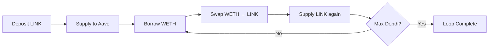

## Overview

The Aave Leverage Strategy (`StrategyAaveLeverage`) is an advanced, high-yield strategy that uses leveraged looping to amplify returns. By repeatedly supplying collateral, borrowing against it, swapping, and resupplying, this strategy can achieve yields significantly higher than simple lending.

**Contract**: `StrategyAaveLeverage.sol` (`packages/contracts/contracts/strategy/StrategyAaveLeverage.sol`)

<Warning>
**High Risk Strategy**: This strategy uses leverage and is subject to liquidation risk. Only suitable for users who understand the risks of leveraged DeFi positions.
</Warning>

## Key Characteristics

| Property | Value |
|----------|-------|
| Risk Level | High |
| Collateral Asset | LINK |
| Borrowed Asset | WETH |
| Protocol | Aave V3 |
| Max Leverage | ~3x (configurable) |
| Yield Source | Amplified Aave supply APY - borrow costs |
| Complexity | Advanced |

## How It Works

### Leveraged Looping Mechanism



**Example Loop** (3 iterations with 60% borrow factor):

1. **Initial**: Deposit 100 LINK
2. **Loop 1**: Borrow 0.001 WETH → Swap to ~0.015 LINK → Supply 0.015 LINK (Total: 100.015 LINK)
3. **Loop 2**: Borrow 0.001 WETH → Swap to ~0.015 LINK → Supply 0.015 LINK (Total: 100.030 LINK)
4. **Loop 3**: Borrow 0.001 WETH → Swap to ~0.015 LINK → Supply 0.015 LINK (Total: 100.045 LINK)

**Result**: ~1.0005x leverage with conservative mock parameters

### Investment Flow

```solidity
// From StrategyAaveLeverage.sol:154-272 (simplified)
function invest(uint256 amount) external override onlyRouter {
    require(!paused, "paused");
    require(amount > 0, "zero amount");
    
    // Initial supply
    pool.supply(address(token), amount, address(this), 0);
    uint256 totalSupplied = amount;
    uint256 totalBorrowedWETH = 0;
    
    // Conservative loop parameters
    uint256 tinyBorrow = 1e15; // 0.001 WETH
    uint256 poolFractionDenominator = 100; // Max 1% of pool
    
    for (uint8 i = 0; i < maxDepth; i++) {
        // 1. Check WETH liquidity in Aave pool
        uint256 poolWethBal = IERC20(WETH).balanceOf(address(pool));
        if (poolWethBal == 0) break;
        
        // 2. Calculate safe borrow amount
        uint256 capFromPool = poolWethBal / poolFractionDenominator;
        uint256 borrowAmountWeth = min(tinyBorrow, capFromPool);
        if (borrowAmountWeth == 0) break;
        
        // 3. Borrow WETH from Aave
        try pool.borrow(WETH, borrowAmountWeth, 2, 0) {
            totalBorrowedWETH += borrowAmountWeth;
        } catch {
            break; // Stop if borrow fails
        }
        
        // 4. Swap WETH → LINK via Uniswap V2 router
        address[] memory path = new address[](2);
        path[0] = WETH;
        path[1] = address(token);
        
        uint256 linkBefore = token.balanceOf(address(this));
        try swapRouter.swapExactTokensForTokens(
            borrowAmountWeth, 0, path, address(this), block.timestamp + 300
        ) {
            uint256 linkAfter = token.balanceOf(address(this));
            uint256 addedLink = linkAfter - linkBefore;
            
            // 5. Supply swapped LINK back to Aave
            try pool.supply(address(token), addedLink, address(this), 0) {
                totalSupplied += addedLink;
            } catch {
                break; // Unwind and stop if supply fails
            }
        } catch {
            break; // Stop if swap fails
        }
    }
    
    // Update accounting
    deposited += amount;
    borrowedWETH += totalBorrowedWETH;
}
```

### Key Safety Features

1. **Conservative Borrow Caps**: Limits borrows to 0.001 WETH per loop
2. **Pool Liquidity Checks**: Never borrows more than 1% of available pool liquidity
3. **Try-Catch Wrappers**: Each step wrapped in try-catch to prevent full revert
4. **Automatic Unwinding**: Attempts to repay if swap or supply fails
5. **Pause Mechanism**: Can be paused to prevent new investments during volatility

## Leverage Parameters

### Configurable Settings

```solidity
// From StrategyAaveLeverage.sol:56-59
uint8 public maxDepth = 3;           // Maximum loop iterations
uint256 public borrowFactor = 6000;  // 60% borrow ratio (parts per 10000)
```

**maxDepth**: Controls how many times the loop executes
- Range: 1-6 (capped for safety)
- Default: 3 iterations
- Higher depth → more leverage → higher risk

**borrowFactor**: Percentage of collateral value to borrow each loop
- Range: 0-8000 (0-80%, capped for safety)
- Default: 6000 (60%)
- Must be below Aave's LTV (Loan-to-Value) ratio
- Includes safety margin to prevent liquidation

### Updating Parameters

```solidity
// From StrategyAaveLeverage.sol:105-111
function setLeverageParams(uint8 _maxDepth, uint256 _borrowFactor) external onlyRouter {
    require(_maxDepth <= 6, "maxDepth too large");
    require(_borrowFactor <= 8000, "borrowFactor too high");
    maxDepth = _maxDepth;
    borrowFactor = _borrowFactor;
    emit LeverageParamsUpdated(_maxDepth, _borrowFactor);
}
```

<Warning>
**Parameter Safety Caps**:
- `maxDepth` capped at 6 to prevent excessive gas costs
- `borrowFactor` capped at 80% to maintain safety margin below Aave LTV
- Typical Aave LTV for LINK: 70-80%
- Recommended `borrowFactor`: 60-70% for safe operations
</Warning>

## Risk Monitoring

### Loan-to-Value (LTV) Tracking

```solidity
// From StrategyAaveLeverage.sol:130-133
function getLTV() external view returns (uint256) {
    if (deposited == 0) return 0;
    return (borrowedWETH * 1e18) / deposited; // 1e18 = 100%
}
```

**LTV Formula**:
```
LTV = (Borrowed WETH Value) / (Deposited LINK Value) * 100%
```

### Risk Assessment

```solidity
// From StrategyAaveLeverage.sol:135-138
function isAtRisk(uint256 maxSafeLTV) external view returns (bool) {
    uint256 ltv = (borrowedWETH * 1e18) / deposited;
    return ltv > maxSafeLTV;
}
```

**Risk Thresholds**:
- **Safe**: LTV < 60%
- **Moderate**: LTV 60-70%
- **High**: LTV 70-80%
- **Critical**: LTV > 80% (liquidation risk)

### Leverage State

```solidity
// From StrategyAaveLeverage.sol:113-128
function getLeverageState()
    external view
    returns (
        uint256 deposited_,
        uint256 borrowed_,
        uint256 netExposure,
        uint256 loops,
        uint8 maxDepth_
    )
{
    deposited_ = deposited;
    borrowed_ = borrowedWETH;
    netExposure = deposited_ > borrowed_ ? deposited_ - borrowed_ : 0;
    loops = maxDepth;
    maxDepth_ = maxDepth;
}
```

## Deleveraging

When market conditions deteriorate or LTV becomes too high, the strategy can unwind positions:

```solidity
// From StrategyAaveLeverage.sol:305-377 (simplified)
function deleverageAll(uint256 maxLoops) external onlyRouter {
    require(!paused, "paused");
    
    for (uint256 i = 0; i < maxLoops; i++) {
        // 1. Check current debt
        uint256 debt = pool.getUserDebt(address(this), WETH);
        if (debt == 0) break;
        
        // 2. Calculate LINK needed to repay debt (with 5% buffer)
        uint256 price = oracle.getPrice(WETH); // LINK per WETH
        uint256 linkNeeded = (debt * price * 105) / (1e18 * 100);
        
        // 3. Withdraw LINK from Aave
        uint256 availableCollateral = pool.getUnderlyingValue(address(this), address(token));
        uint256 withdrawAmt = min(linkNeeded, availableCollateral);
        uint256 gotLINK = pool.withdraw(address(token), withdrawAmt, address(this));
        
        // 4. Swap LINK → WETH
        address[] memory path = new address[](2);
        path[0] = address(token);
        path[1] = WETH;
        
        try swapRouter.swapExactTokensForTokens(
            gotLINK, 0, path, address(this), block.timestamp + 300
        ) {
            uint256 wethOut = IERC20(WETH).balanceOf(address(this));
            
            // 5. Repay WETH debt
            uint256 repaid = pool.repay(WETH, min(wethOut, debt), 2, address(this));
            
            // Update accounting
            borrowedWETH = borrowedWETH <= repaid ? 0 : borrowedWETH - repaid;
            deposited = deposited <= gotLINK ? 0 : deposited - gotLINK;
        } catch {
            break;
        }
    }
}
```

**Deleveraging Process**:
1. Check current WETH debt
2. Calculate LINK needed (using price oracle + 5% buffer)
3. Withdraw LINK collateral from Aave
4. Swap LINK → WETH
5. Repay WETH debt
6. Repeat until debt is zero or max loops reached

## Balance Calculation

The strategy reports net value accounting for debt:

```solidity
// From StrategyAaveLeverage.sol:381-393
function strategyBalance() public view override returns (uint256) {
    uint256 collateral = pool.getUnderlyingValue(address(this), address(token));
    uint256 idle = token.balanceOf(address(this));
    uint256 total = collateral + idle;
    
    if (borrowedWETH == 0) return total;
    
    // Convert WETH debt to LINK value
    uint256 price = oracle.getPrice(WETH); // LINK per WETH
    uint256 debtValue = borrowedWETH * price / 1e18;
    
    if (debtValue >= total) return 0;
    return total - debtValue;
}
```

**Formula**:
```
Net Balance = (LINK Collateral + Idle LINK) - (WETH Debt in LINK terms)
```

## Harvesting

```solidity
// From StrategyAaveLeverage.sol:291-302
function harvest() external override onlyRouter {
    (address aTokenAddr, , ) = dataProvider.getReserveTokensAddresses(address(token));
    uint256 aBal = IERC20(aTokenAddr).balanceOf(address(this));
    
    if (aBal > deposited) {
        uint256 profit = aBal - deposited;
        uint256 out = pool.withdraw(address(token), profit, address(this));
        token.safeTransfer(vault, out);
        emit Harvested(out);
    }
}
```

Harvesting withdraws profits (aToken balance exceeding principal) and sends to vault.

## Pause Mechanism

```solidity
// From StrategyAaveLeverage.sol:68
bool public paused;

// From StrategyAaveLeverage.sol:142-145
function togglePause() external onlyRouter {
    paused = !paused;
    emit PauseToggled(paused);
}
```

When paused:
- Cannot invest new funds
- Cannot deleverage
- Can still withdraw (for emergency exits)
- Can still harvest

## Risk Profile

### High Risk Factors

⚠️ **Liquidation Risk**: If LINK price drops or WETH price rises, LTV increases and position may be liquidated

⚠️ **Impermanent Loss**: Swap price impact during leverage loops and deleveraging

⚠️ **Smart Contract Risk**: Exposure to Aave, Uniswap, and strategy contract risks

⚠️ **Oracle Risk**: Relies on price oracle for deleveraging calculations

⚠️ **Market Volatility**: Rapid price movements can push position into liquidation

⚠️ **Gas Costs**: Complex loops require significant gas, reducing net yields

### Risk Mitigation

✅ **Conservative Parameters**: Default 60% borrow factor with safety margin

✅ **Loop Limits**: Max 6 iterations prevents excessive leverage

✅ **Liquidity Checks**: Never borrows more than 1% of pool liquidity

✅ **Try-Catch Safety**: Each step can fail gracefully without reverting entire transaction

✅ **AI Monitoring**: Strategy Sentinel Agent continuously monitors LTV and triggers deleveraging

✅ **Pause Control**: Can halt new investments during volatility

✅ **Automated Deleveraging**: AI automatically reduces leverage when risk thresholds exceeded

## APY Calculation

**Leveraged APY Formula**:
```
Leveraged APY = (Supply APY × Leverage Ratio) - (Borrow APY × Borrow Ratio) - Fees
```

**Example** (hypothetical):
- LINK Supply APY: 2%
- WETH Borrow APY: 3%
- Leverage: 3x
- Borrow Ratio: 2x (borrowed 2 WETH per 1 LINK collateral)

```
Leveraged APY = (2% × 3) - (3% × 2) - Fees
              = 6% - 6% - Fees
              = Negative (unprofitable)
```

<Warning>
**Profitability Depends On**:
- Supply APY > Borrow APY (positive spread)
- AAVE rewards and incentives
- Efficient leverage ratio
- Low gas costs relative to position size

Always verify that supply APY exceeds borrow costs before using this strategy.
</Warning>

## Development Note

<Info>
For development and testing, this strategy uses **mock contracts**:
- **Mock Aave Pool**: Simulates borrow, repay, supply, withdraw
- **Mock Swap Router**: Simulates Uniswap V2 swaps with fixed rates
- **Mock Price Oracle**: Returns programmable prices for LINK/WETH
- **Mock LTV**: All liquidation thresholds use mocked logic

This allows predictable testing without mainnet liquidity constraints.
</Info>

## AI Management

The **Strategy Sentinel Agent** actively manages this strategy:

1. **Continuous Monitoring**: Checks LTV every block
2. **Price Tracking**: Monitors LINK and WETH prices via oracle
3. **Risk Assessment**: Compares current LTV against safe thresholds
4. **Automatic Deleveraging**: Calls `triggerDeleverage()` when LTV > 70%
5. **Rebalancing**: Reduces allocation to leverage strategy during high volatility
6. **Pause Control**: Pauses strategy during extreme market conditions

## Access Control

```solidity
// From StrategyAaveLeverage.sol:62-65
modifier onlyRouter() {
    require(msg.sender == router, "not router");
    _;
}
```

All critical functions restricted to StrategyRouter:
- `invest()`
- `withdrawToVault()`
- `harvest()`
- `deleverageAll()`
- `setLeverageParams()`
- `togglePause()`

## Related Documentation

<CardGroup cols={2}>
  <Card title="Aave V3 Strategy" icon="shield-halved" href="/strategies/aave-v3-strategy">
    Compare with safe lending strategy
  </Card>
  <Card title="Risk Management" icon="triangle-exclamation" href="/strategies/risk-management">
    Deep dive into risk controls
  </Card>
  <Card title="Strategy Overview" icon="layer-group" href="/strategies/overview">
    Return to strategies overview
  </Card>
  <Card title="AI Agents" icon="robot" href="/agents/overview">
    Learn about AI risk management
  </Card>
</CardGroup>