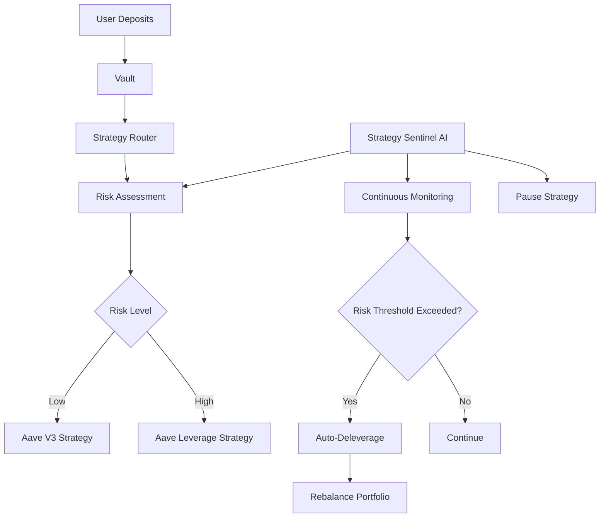

## Overview

MetaVault AI employs a comprehensive risk management framework combining smart contract safety mechanisms, configurable risk parameters, and AI-driven monitoring to protect user funds while optimizing yields.

## Risk Framework Architecture



## Multi-Layer Risk Protection

### Layer 1: Smart Contract Controls

**Access Control**:
```solidity
// All strategies implement onlyRouter modifier
modifier onlyRouter() {
    require(msg.sender == router, "not router");
    _;
}
```

Prevents unauthorized fund movements and ensures all strategy operations go through the audited StrategyRouter.

**Try-Catch Error Handling**:
```solidity
// From StrategyRouter.sol:150-157
try IStrategy(strat).withdrawToVault(need) {
    // success path
} catch (bytes memory reason) {
    string memory msgStr = _decodeRevertReason(reason);
    emit StrategyWithdrawFailed(strat, msgStr);
    continue; // Move to next strategy
}
```

Graceful degradation ensures single strategy failures don't halt the entire system.

### Layer 2: Parameter Constraints

**Leverage Caps** (`StrategyAaveLeverage.sol:106-107`):
```solidity
require(_maxDepth <= 6, "maxDepth too large");
require(_borrowFactor <= 8000, "borrowFactor too high"); // 80% max
```

**Allocation Validation** (`StrategyRouter.sol:61`):
```solidity
require(total == 10000, "targets must sum 10000"); // Must equal 100%
```

### Layer 3: AI-Driven Monitoring

**Strategy Sentinel Agent** continuously:
1. Monitors LTV ratios across all leveraged positions
2. Tracks real-time token prices (LINK/WETH)
3. Assesses market volatility
4. Triggers automatic deleveraging when risk thresholds exceeded
5. Adjusts portfolio allocations based on market conditions

## Risk Parameters by Strategy

### Aave V3 Strategy (Low Risk)

| Parameter | Value | Risk Impact |
|-----------|-------|-------------|
| Leverage | None (1x) | No liquidation risk |
| Asset Type | USDC (Stablecoin) | Minimal price volatility |
| Protocol Exposure | Aave V3 only | Single protocol risk |
| Complexity | Simple supply | Low operational risk |
| LTV | N/A | Not applicable |

**Risk Score**: 2/10

### Aave Leverage Strategy (High Risk)

| Parameter | Default | Range | Risk Impact |
|-----------|---------|-------|-------------|
| **maxDepth** | 3 loops | 1-6 | Higher = more leverage = higher risk |
| **borrowFactor** | 6000 (60%) | 0-8000 (0-80%) | Higher = closer to liquidation |
| **Collateral** | LINK | N/A | Volatile asset (±10-30% daily) |
| **Borrowed Asset** | WETH | N/A | Volatile asset (±5-15% daily) |
| **Max LTV** | ~80% | N/A | Liquidation threshold |
| **Target LTV** | 60% | N/A | Operating target with safety margin |

**Risk Score**: 8/10

<Warning>
**Critical Risk**: LINK/WETH price ratio changes directly impact LTV. A 20% drop in LINK or 20% rise in WETH can push LTV from 60% to 72%, approaching liquidation.
</Warning>

## Loan-to-Value (LTV) Management

### What is LTV?

**Formula**:
```
LTV = (Borrowed Value / Collateral Value) × 100%
```

**Example**:
- Deposited: 100 LINK ($1,500 @ $15/LINK)
- Borrowed: 0.5 WETH ($1,000 @ $2,000/WETH)
- LTV = $1,000 / $1,500 = 66.7%

### LTV Risk Zones

```
0%        40%        60%        70%        80%      100%
|---------|----------|----------|----------|---------|---->
   Safe     Moderate    Target     High     Critical
           Risk Level
```

| Zone | LTV Range | Status | Actions |
|------|-----------|--------|----------|
| Safe | 0-40% | Very low risk | Continue normal operations |
| Moderate | 40-60% | Acceptable risk | Monitor closely |
| Target | 60-70% | Optimal efficiency | Default operating zone |
| High | 70-80% | Elevated risk | **AI triggers deleveraging** |
| Critical | 80%+ | Liquidation risk | **Emergency deleverage + pause** |

### LTV Monitoring

**Contract Function**:
```solidity
// From StrategyAaveLeverage.sol:130-133
function getLTV() external view returns (uint256) {
    if (deposited == 0) return 0;
    return (borrowedWETH * 1e18) / deposited; // 1e18 = 100%
}
```

**AI Monitoring Loop**:
```typescript
// Pseudo-code from Strategy Sentinel Agent
while (true) {
  const ltv = await strategy.getLTV();
  const linkPrice = await oracle.getPrice(LINK);
  const wethPrice = await oracle.getPrice(WETH);
  
  const actualLTV = (borrowedWETH * wethPrice) / (depositedLINK * linkPrice);
  
  if (actualLTV > 0.70) {
    // High risk zone
    await router.triggerDeleverage(strategy.address, 5);
    await router.rebalance(); // Shift allocation to safe strategy
  }
  
  if (actualLTV > 0.80) {
    // Critical zone
    await strategy.togglePause(); // Halt new investments
    await router.triggerDeleverage(strategy.address, 10); // Aggressive unwind
  }
  
  await sleep(60000); // Check every minute
}
```

## Deleveraging Mechanics

### When Deleveraging Triggers

1. **LTV Threshold Breach**: LTV > 70%
2. **Market Volatility**: LINK price drops > 15% in 1 hour
3. **Manual Override**: Admin/AI agent triggers manually
4. **Health Factor**: Aave health factor < 1.2

### Deleveraging Process

```solidity
// From StrategyAaveLeverage.sol:305-377 (simplified)
function deleverageAll(uint256 maxLoops) external onlyRouter {
    for (uint256 i = 0; i < maxLoops; i++) {
        uint256 debt = pool.getUserDebt(address(this), WETH);
        if (debt == 0) break;
        
        // 1. Calculate LINK needed to repay debt (with 5% buffer)
        uint256 price = oracle.getPrice(WETH);
        uint256 linkNeeded = (debt * price * 105) / (1e18 * 100);
        
        // 2. Withdraw LINK collateral
        uint256 withdrawAmt = min(linkNeeded, availableCollateral);
        pool.withdraw(address(token), withdrawAmt, address(this));
        
        // 3. Swap LINK → WETH
        swapRouter.swapExactTokensForTokens(...);
        
        // 4. Repay WETH debt
        pool.repay(WETH, wethOut, 2, address(this));
        
        // 5. Update accounting
        borrowedWETH -= repaid;
        deposited -= withdrawn;
    }
}
```

**Steps**:
1. Calculate current WETH debt
2. Determine LINK needed (price oracle + 5% slippage buffer)
3. Withdraw LINK from Aave
4. Swap LINK → WETH on Uniswap
5. Repay WETH debt to Aave
6. Repeat until debt eliminated or max loops reached

### Router Integration

```solidity
// From StrategyRouter.sol:246-267
function triggerDeleverage(address strat, uint256 maxLoops) external onlyOwner {
    require(strat != address(0), "zero strat");
    require(maxLoops > 0, "maxLoops must be > 0");
    
    try IStrategy(strat).deleverageAll(maxLoops) {
        emit DeleverageTriggered(strat, maxLoops);
    } catch (bytes memory reason) {
        emit StrategyWithdrawFailed(strat, _decodeRevertReason(reason));
    }
}
```

Router can trigger deleveraging with configurable loop count:
- **Partial Deleverage**: `maxLoops = 1-3` (reduce risk gradually)
- **Full Deleverage**: `maxLoops = 10` (emergency unwind)

## Portfolio Rebalancing

### Dynamic Allocation

The StrategyRouter adjusts allocations based on risk levels:

**Normal Conditions** (Low Volatility):
```
Aave V3 Strategy:    40% (4000 bps)
Leverage Strategy:   60% (6000 bps)
```

**High Volatility Detected**:
```
Aave V3 Strategy:    70% (7000 bps)
Leverage Strategy:   30% (3000 bps)
```

**Critical Risk**:
```
Aave V3 Strategy:   100% (10000 bps)
Leverage Strategy:    0% (0 bps) [Paused]
```

### Rebalance Function

```solidity
// From StrategyRouter.sol:176-232 (simplified)
function rebalance() external onlyOwner {
    uint256 totalManaged = _computeTotalManaged();
    
    // 1. Withdraw from overweight strategies
    for (uint256 i = 0; i < strategies.length; i++) {
        address strat = strategies[i];
        uint256 current = IStrategy(strat).strategyBalance();
        uint256 desired = (totalManaged * targetBps[strat]) / 10000;
        
        if (current > desired) {
            uint256 excess = current - desired;
            try IStrategy(strat).withdrawToVault(excess) returns (uint256 withdrawn) {
                vault.receiveFromStrategy(withdrawn);
            } catch { /* Continue to next strategy */ }
        }
    }
    
    // 2. Deploy to underweight strategies
    totalManaged = _computeTotalManaged();
    uint256 vaultBal = vault.totalAssets();
    
    for (uint256 i = 0; i < strategies.length; i++) {
        address strat = strategies[i];
        uint256 current = IStrategy(strat).strategyBalance();
        uint256 desired = (totalManaged * targetBps[strat]) / 10000;
        
        if (current < desired && vaultBal > 0) {
            uint256 need = desired - current;
            uint256 amt = min(need, vaultBal);
            
            vault.moveToStrategy(strat, amt);
            try IStrategy(strat).invest(amt) {
                vaultBal -= amt;
            } catch { /* Funds in strategy but not invested */ }
        }
    }
}
```

## Price Oracle Risk

### Oracle Dependency

The Leverage Strategy relies on price oracle for:
- Calculating LTV ratios
- Determining deleverage amounts
- Computing strategy balance

```solidity
// From StrategyAaveLeverage.sol:50
IPriceOracle public immutable oracle;

// Usage in deleveraging:
uint256 price = oracle.getPrice(WETH); // LINK per WETH
```

### Oracle Risks

<Warning>
**Oracle Manipulation**: Flash loan attacks or oracle failures could provide incorrect prices, leading to:
- Under/over deleveraging
- Incorrect balance reporting
- Unexpected liquidations

**Mitigation**:
- Use Chainlink price feeds (battle-tested, manipulation-resistant)
- Implement price sanity checks
- Add time-weighted average price (TWAP) validation
</Warning>

## Liquidity Risk

### Aave Pool Liquidity

The Leverage Strategy checks pool liquidity before borrowing:

```solidity
// From StrategyAaveLeverage.sol:181-189
uint256 poolWethBal = IERC20(WETH).balanceOf(address(pool));
if (poolWethBal == 0) break;

uint256 capFromPool = poolWethBal / 100; // Max 1% of pool
uint256 borrowAmountWeth = min(tinyBorrow, capFromPool);
```

**Safety Measures**:
- Never borrows more than 1% of available pool liquidity
- Prevents draining small pools
- Reduces borrow rejection risk

### Swap Liquidity

Uniswap V2 swaps may experience high slippage during:
- Low liquidity pairs
- Large trade sizes
- Market volatility

**Current Implementation**:
```solidity
// From StrategyAaveLeverage.sol:214
swapRouter.swapExactTokensForTokens(
    borrowAmountWeth,
    0, // amountOutMin = 0 (NO SLIPPAGE PROTECTION)
    path,
    address(this),
    block.timestamp + 300
);
```

<Warning>
**Slippage Risk**: Current implementation has `amountOutMin = 0`, accepting unlimited slippage.

**Recommendation**: Implement slippage protection:
```solidity
uint256 minOut = (expectedOut * 95) / 100; // 5% max slippage
swapRouter.swapExactTokensForTokens(
    borrowAmountWeth,
    minOut, // Minimum acceptable output
    path,
    address(this),
    block.timestamp + 300
);
```
</Warning>

## Emergency Controls

### Pause Mechanism

```solidity
// From StrategyAaveLeverage.sol:68
bool public paused;

// From StrategyAaveLeverage.sol:142-145
function togglePause() external onlyRouter {
    paused = !paused;
    emit PauseToggled(paused);
}

// Enforced in invest() and deleverageAll():
require(!paused, "paused");
```

**When to Pause**:
- LTV > 80% (critical zone)
- Oracle failures detected
- Aave pool liquidity crisis
- Smart contract exploit discovered
- Extreme market volatility (>30% daily move)

**Effects**:
- ✅ Prevents new investments
- ✅ Prevents deleveraging (to avoid forced selling during panic)
- ❌ Does NOT prevent withdrawals (users can always exit)
- ❌ Does NOT prevent harvesting (collect yields)

### Strategy Isolation

Each strategy operates independently:
- Failure in one strategy doesn't affect others
- Router's try-catch prevents cascade failures
- Users can withdraw from healthy strategies even if one fails

## Withdrawal Safety

### Multi-Strategy Withdrawal

```solidity
// From StrategyRouter.sol:135-170 (simplified)
function withdrawFromStrategies(uint256 amount) external returns (uint256) {
    require(msg.sender == address(vault), "not vault");
    
    uint256 pulled = 0;
    
    // Iterate through strategies until amount satisfied
    for (uint256 i = 0; i < strategies.length && pulled < amount; i++) {
        address strat = strategies[i];
        uint256 need = amount - pulled;
        
        try IStrategy(strat).withdrawToVault(need) {
            uint256 got = vault.totalAssets() - beforeBal;
            pulled += got;
        } catch {
            // Strategy failed, try next one
            continue;
        }
    }
    
    require(pulled >= amount, "strategies insufficient");
    return pulled;
}
```

**Safety Features**:
1. **Graceful Degradation**: If one strategy fails, tries next
2. **Balance Verification**: Measures actual vault balance changes
3. **Revert Protection**: Try-catch prevents single strategy from blocking withdrawals
4. **Sufficiency Check**: Ensures full requested amount withdrawn

## Smart Contract Risks

### Protocol Dependencies

| Protocol | Exposure | Risk Level | Audit Status |
|----------|----------|------------|-------------|
| **Aave V3** | All strategies | Medium | Audited by multiple firms |
| **Uniswap V2** | Leverage strategy swaps | Medium | Audited, battle-tested |
| **OpenZeppelin** | ERC20, Ownable, SafeERC20 | Low | Industry standard |
| **MetaVault Contracts** | Core vault logic | High | **[Audit status unknown]** |

<Warning>
**Multi-Protocol Risk**: Leverage strategy exposes users to Aave, Uniswap, and price oracle risks simultaneously. A vulnerability in any component could affect user funds.
</Warning>

### Upgrade Risk

**Immutable Contracts**: Strategy contracts use `immutable` for critical addresses:

```solidity
// From StrategyAaveLeverage.sol:39-50
IERC20 public immutable token;
address public immutable vault;
address public immutable router;
IPool public immutable pool;
IProtocolDataProvider public immutable dataProvider;
ISwapRouterV2 public immutable swapRouter;
address public immutable WETH;
IPriceOracle public immutable oracle;
```

**Implications**:
- ✅ Cannot be changed after deployment (prevents malicious upgrades)
- ❌ Cannot fix bugs or change protocols without deploying new strategy
- ⚠️ Requires careful testing before deployment

## Gas Cost Risks

### Leverage Loop Costs

Each leverage loop iteration costs gas:
- Supply LINK: ~150k gas
- Borrow WETH: ~200k gas
- Swap: ~120k gas
- Total per loop: ~470k gas

**3 Loops** (default): ~1.4M gas (~$50-200 depending on gas prices)

**6 Loops** (max): ~2.8M gas (~$100-400)

<Warning>
High gas costs can erase yields for small positions. Recommended minimum position size: $10,000+ for leverage strategy.
</Warning>

## Development Environment

<Info>
**Mock Contracts for Testing**:

All strategies currently use mock implementations:
- **Mock Aave Pool**: Simulates supply, borrow, withdraw, repay
- **Mock Liquidity Index**: Programmatically controlled interest accrual
- **Mock Swap Router**: Fixed exchange rates for predictable testing
- **Mock Price Oracle**: Returns configurable prices
- **Mock LTV Calculations**: Simplified risk calculations

This allows comprehensive testing without mainnet constraints, but production deployment requires integration with real protocols.
</Info>

## Risk Checklist for Users

Before depositing, users should verify:

- [ ] Understand liquidation risks for leveraged strategies
- [ ] Check current LTV ratios (should be < 70%)
- [ ] Verify Aave pool has sufficient liquidity
- [ ] Confirm supply APY > borrow APY for leverage strategy
- [ ] Review current portfolio allocation (safe vs. aggressive)
- [ ] Check if strategies are paused
- [ ] Understand that smart contracts are **not insured**
- [ ] Be aware of potential oracle manipulation risks
- [ ] Know that withdrawals may take time during high LTV
- [ ] Understand performance fees will be deducted

## AI Risk Management

The **Strategy Sentinel Agent** provides:

### Real-Time Monitoring
- LTV tracking (every 60 seconds)
- Price feed monitoring (LINK, WETH)
- Aave pool health checks
- Gas price monitoring (for cost-effective operations)

### Automated Responses
- **LTV 60-70%**: Log warning, increase monitoring frequency
- **LTV 70-75%**: Trigger partial deleverage (3 loops)
- **LTV 75-80%**: Trigger aggressive deleverage (10 loops)
- **LTV >80%**: Emergency pause + full deleverage
- **Price drops >15%**: Reduce leverage strategy allocation
- **Oracle failures**: Pause all leveraged operations

### Portfolio Optimization
- Rebalances allocation based on market volatility
- Harvests yields at optimal gas prices
- Compounds profits back into strategies
- Adjusts leverage parameters during calm markets

## Related Documentation

<CardGroup cols={2}>
  <Card title="Aave V3 Strategy" icon="shield-halved" href="/strategies/aave-v3-strategy">
    Low-risk lending strategy details
  </Card>
  <Card title="Aave Leverage Strategy" icon="chart-line" href="/strategies/aave-leverage-strategy">
    High-risk leveraged strategy details
  </Card>
  <Card title="Strategy Overview" icon="layer-group" href="/strategies/overview">
    Multi-strategy architecture
  </Card>
  <Card title="AI Agents" icon="robot" href="/agents/overview">
    AI-driven risk management
  </Card>
</CardGroup>